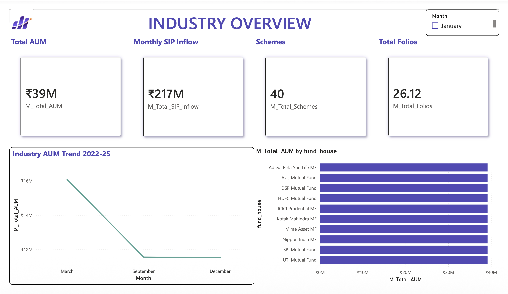
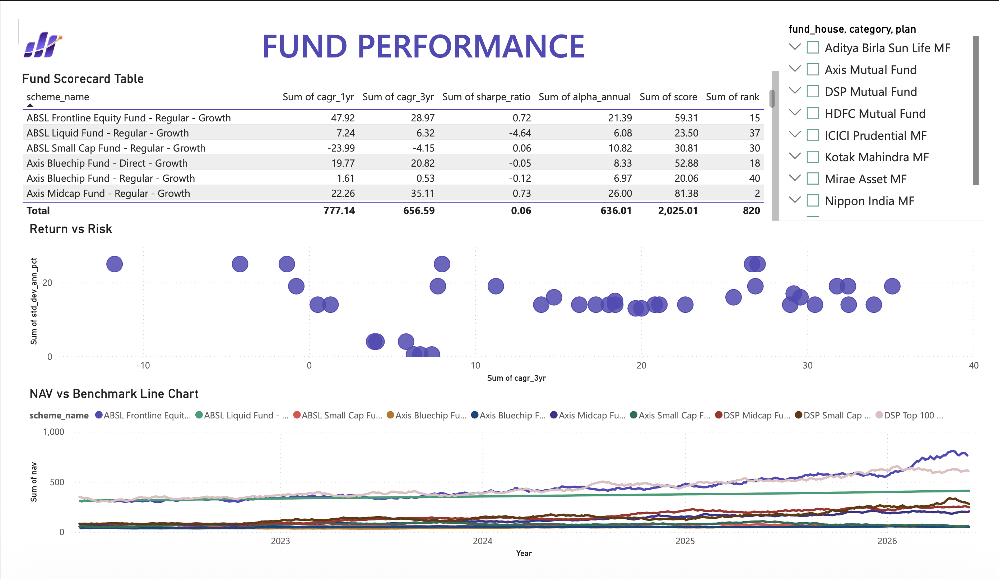
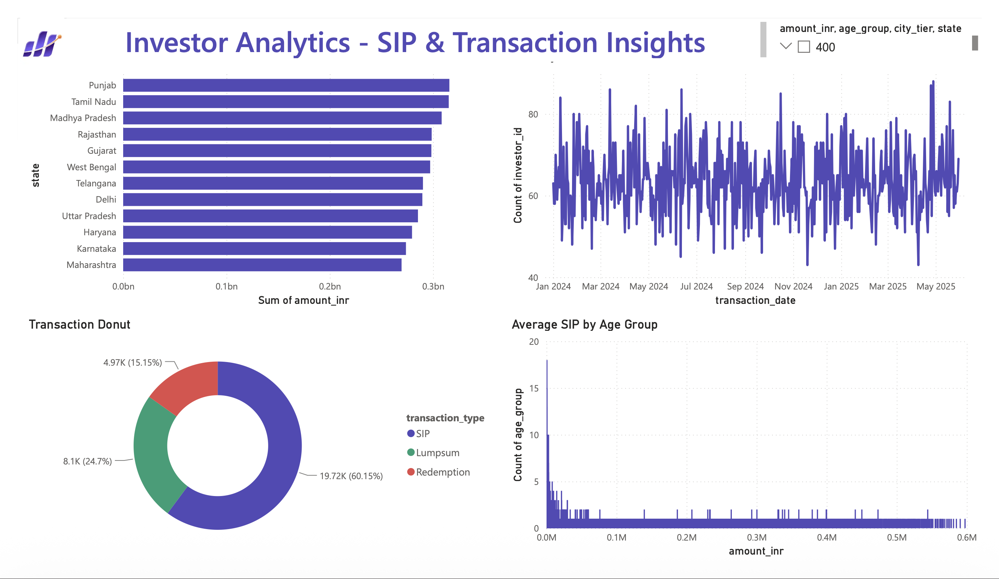
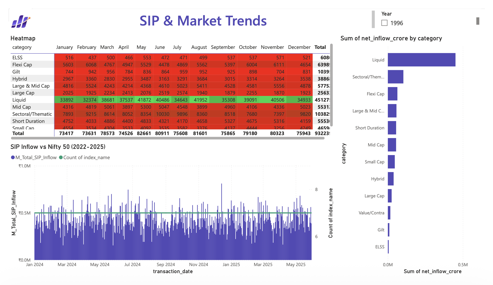

# Bluestock MF Capstone
Mutual Fund Analytics Platform
# Bluestock Mutual Fund Analytics Platform

> An end-to-end mutual fund analytics platform — ETL pipeline, SQLite data warehouse, quantitative performance analytics, and a 4-page Power BI dashboard covering 40 Indian mutual fund schemes (2022–2026).

## Dashboard preview
### Page 1 — Industry Overview


### Page 2 — Fund Performance


### Page 3 — Investor Analytics


### Page 4 — SIP & Market Trends


---

## Overview

This project simulates a real-world analytics engagement for a fintech company: raw scheme-level CSVs and a live NAV API are transformed into a queryable star-schema database, enriched with quantitative risk and performance metrics (CAGR, Sharpe, Sortino, Alpha/Beta, VaR/CVaR, HHI), and surfaced through an interactive Power BI dashboard and a fund recommender tool.

**At a glance**

| Metric | Value |
|---|---|
| Mutual fund schemes covered | 40 |
| NAV records | 52,400+ |
| Investor transactions | 15,000+ |
| Dashboard pages | 4 |
| Quant metrics computed | 8 (CAGR, Sharpe, Sortino, Alpha, Beta, Max Drawdown, VaR/CVaR, HHI) |
| Date range | Jan 2022 – Jun 2026 |

---

## Architecture

```
Raw CSVs (10) + Live NAV API
        │
        ▼
   ETL Pipeline  ──────────────►  data/processed/*.csv
        │
        ▼
  SQLite Database (star schema)
        │
        ▼
  Analytics Layer (Python/Jupyter)
   ├─ EDA & visualisation
   ├─ Performance metrics
   └─ Risk metrics
        │
        ▼
  Power BI Dashboard (4 pages)
   + Fund Recommender (CLI)
```

---

## Project structure

```
bluestock-mf-capstone/
│
├── data/
│   ├── raw/                    # 10 source CSVs + live-fetched NAV data
│   ├── processed/              # cleaned CSVs + computed metric tables
│   └── db/                      # SQLite database (gitignored)
│
├── notebooks/
│   ├── 01_data_ingestion.ipynb       # Day 1 — load & inspect raw data
│   ├── 02_data_cleaning.ipynb        # Day 2 — cleaning + DB load
│   ├── 03_EDA_Analysis.ipynb         # Day 3 — exploratory data analysis
│   ├── 04_Performance_Analytics.ipynb # Day 4 — CAGR, Sharpe, Alpha/Beta
│   └── 05_Advanced_Analytics.ipynb   # Day 6 — VaR, cohorts, HHI
│
├── scripts/
│   ├── etl_pipeline.py         # master ETL: ingest → clean → load to SQLite
│   ├── live_nav_fetch.py       # mfapi.in live NAV fetcher
│   ├── compute_metrics.py      # standalone metric computation (CAGR/Sharpe/etc.)
│   ├── recommender.py          # interactive fund recommender (CLI)
│   └── run_pipeline.py         # one-command full pipeline runner
│
├── sql/
│   ├── schema.sql               # star schema CREATE TABLE statements
│   └── queries.sql              # 10 analytical queries
│
├── dashboard/
│   ├── bluestock_mf_dashboard.pbix
│   └── screenshots/              # PNG export of each dashboard page
│
├── reports/
│   ├── charts/                   # all matplotlib/seaborn/plotly chart PNGs
│   ├── data_dictionary.md        # column-level documentation for all 10 datasets
│   ├── Final_Report.pdf          # 15–20 page analytical report
│   └── Bluestock_MF_Presentation.pptx
│
├── requirements.txt
├── .gitignore
└── README.md
```

---

## Tech stack

| Layer | Tools |
|---|---|
| Data ingestion | Python, Pandas, Requests, mfapi.in REST API |
| Data cleaning | Pandas, NumPy |
| Database | SQLite, SQLAlchemy (star schema: 2 dimension + 4 fact tables) |
| Analytics | NumPy, SciPy (`linregress`), Pandas |
| Visualisation | Matplotlib, Seaborn, Plotly |
| Dashboard | Power BI Desktop, DAX |
| Version control | Git, GitHub |

---

## Database schema

Star schema with two dimension tables and four fact tables:

| Table | Type | Description |
|---|---|---|
| `dim_fund` | Dimension | Scheme name, fund house, category, risk grade, expense ratio |
| `dim_date` | Dimension | Calendar attributes — year, month, quarter, weekend flag |
| `fact_nav` | Fact | Daily NAV per scheme |
| `fact_transactions` | Fact | SIP / Lumpsum / Redemption transactions |
| `fact_performance` | Fact | 1Y/3Y/5Y returns, Sharpe, Sortino, expense ratio |
| `fact_aum` | Fact | Monthly AUM per fund house |

Full DDL: [`sql/schema.sql`](sql/schema.sql)

---

## Quantitative metrics computed

| Metric | Formula | Purpose |
|---|---|---|
| CAGR (1/3/5yr) | `(NAV_end/NAV_start)^(1/n) - 1` | Annualised growth rate |
| Sharpe Ratio | `(Rp - Rf)/Std(Rp) × √252` | Risk-adjusted return |
| Sortino Ratio | `(Rp - Rf)/DownsideStd × √252` | Downside-risk-adjusted return |
| Alpha / Beta | OLS regression vs Nifty 100 | Market sensitivity & excess return |
| Maximum Drawdown | `min(NAV/running_max - 1)` | Worst peak-to-trough loss |
| VaR (95%) / CVaR | 5th percentile / tail mean of daily returns | Downside risk exposure |
| Sector HHI | `Σ(weight_i²) × 10000` | Portfolio concentration |
| Fund Scorecard (0–100) | Weighted composite of the above | Overall fund ranking |

---

## Setup & installation

```bash
git clone https://github.com/anweshaghosh06/bluestock-mf-capstone.git
cd bluestock-mf-capstone
pip install -r requirements.txt
```

## How to run

**Full pipeline (ETL + database build):**
```bash
python scripts/run_pipeline.py
```

**Individual steps:**
```bash
python scripts/etl_pipeline.py        # ingest + clean + load to SQLite
python scripts/compute_metrics.py      # compute CAGR, Sharpe, Alpha/Beta, etc.
python scripts/recommender.py          # interactive fund recommender
```

**Analytics notebooks** — open in Jupyter / VS Code, run top to bottom:
```bash
jupyter notebook notebooks/
```

## Opening the dashboard

1. Install [Power BI Desktop](https://powerbi.microsoft.com/desktop/) (free)
2. Open `dashboard/bluestock_mf_dashboard.pbix`
3. If prompted, update data source paths via **Transform Data → Data source settings**

---

## Dashboard pages

| Page | Contents |
|---|---|
| 1. Industry Overview | KPI cards (AUM, SIP inflow, folios, schemes), industry AUM trend, AUM by AMC |
| 2. Fund Performance | Return vs risk bubble chart, sortable fund scorecard, NAV vs benchmark |
| 3. Investor Analytics | SIP by state, transaction type split, age group analysis, monthly volume |
| 4. SIP & Market Trends | SIP inflow vs Nifty 50 (dual axis), category inflow heatmap, FY25 top categories |

---

## Key findings

- SIP inflows grew **2.4×**, from ₹12,900 Cr (Jan 2022) to ₹31,002 Cr (Dec 2025)
- **SBI Mutual Fund** leads industry AUM at ₹12.5L Cr — nearly 2× the next largest AMC
- Top-ranked fund (SBI Bluechip Direct): Sharpe **1.24**, 3Y CAGR **16.81%**, composite score **87.4/100**
- **27%** of regular SIP investors are flagged "at-risk" (average payment gap > 35 days)
- Industry folio count doubled from **13.26 Cr to 26.12 Cr** in four years

---

## Limitations

- Live NAV data sourced from a single public API (mfapi.in); no redundancy if the API is unavailable
- Investor demographic and transaction data is synthetic, generated for project purposes
- Dashboard does not include real-time refresh — data is snapshot-based
- No coverage of derivatives, options, or international funds

---

## Author

**Anwesha Ghosh**
B.Tech CSE, Institute of Engineering and Management (IEM), Kolkata
Data Analyst Intern, Bluestock Fintech

[GitHub](https://github.com/anweshaghosh06) · [LinkedIn](#)

---

## License

This project is licensed under the MIT License — see [LICENSE](LICENSE) for details.
